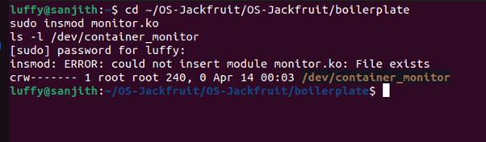
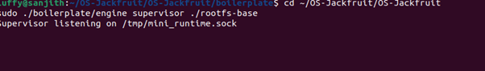
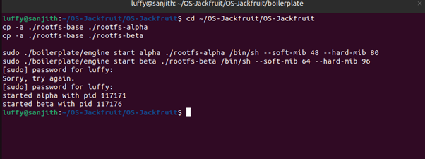
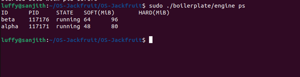
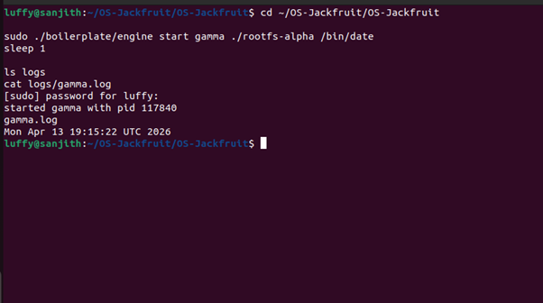
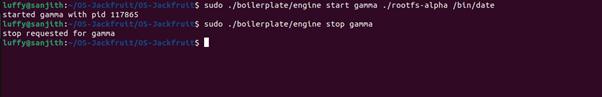
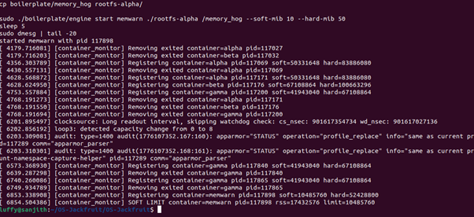
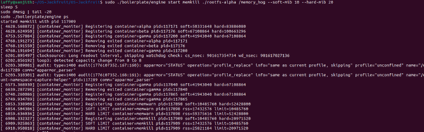
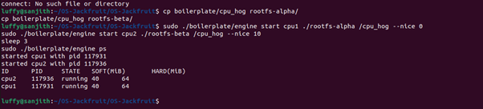
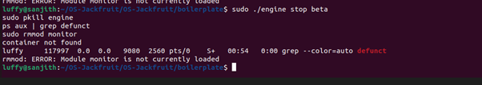

# Multi-Container Runtime

A lightweight Linux container runtime in C with a long-running supervisor and a kernel-space memory monitor.

Read [`project-guide.md`](project-guide.md) for the full project specification.

---

## Getting Started

### 1. Fork the Repository

1. Go to [github.com/shivangjhalani/OS-Jackfruit](https://github.com/shivangjhalani/OS-Jackfruit)
2. Click **Fork** (top-right)
3. Clone your fork:

```bash
git clone https://github.com/<your-username>/OS-Jackfruit.git
cd OS-Jackfruit
```

### 2. Set Up Your VM

You need an **Ubuntu 22.04 or 24.04** VM with **Secure Boot OFF**. WSL will not work.

Install dependencies:

```bash
sudo apt update
sudo apt install -y build-essential linux-headers-$(uname -r)
```

### 3. Run the Environment Check

```bash
cd boilerplate
chmod +x environment-check.sh
sudo ./environment-check.sh
```

Fix any issues reported before moving on.

### 4. Prepare the Root Filesystem

```bash
mkdir rootfs-base
wget https://dl-cdn.alpinelinux.org/alpine/v3.20/releases/x86_64/alpine-minirootfs-3.20.3-x86_64.tar.gz
tar -xzf alpine-minirootfs-3.20.3-x86_64.tar.gz -C rootfs-base

# Make one writable copy per container you plan to run
cp -a ./rootfs-base ./rootfs-alpha
cp -a ./rootfs-base ./rootfs-beta
```

Do not commit `rootfs-base/` or `rootfs-*` directories to your repository.

### 5. Understand the Boilerplate

The `boilerplate/` folder contains starter files:

| File                   | Purpose                                             |
| ---------------------- | --------------------------------------------------- |
| `engine.c`             | User-space runtime and supervisor skeleton          |
| `monitor.c`            | Kernel module skeleton                              |
| `monitor_ioctl.h`      | Shared ioctl command definitions                    |
| `Makefile`             | Build targets for both user-space and kernel module |
| `cpu_hog.c`            | CPU-bound test workload                             |
| `io_pulse.c`           | I/O-bound test workload                             |
| `memory_hog.c`         | Memory-consuming test workload                      |
| `environment-check.sh` | VM environment preflight check                      |

Use these as your starting point. You are free to restructure the repository however you want — the submission requirements are listed in the project guide.

### 6. Build and Verify

```bash
cd boilerplate
make
```

If this compiles without errors, your environment is ready.

---

## What to Do Next

Read [`project-guide.md`](project-guide.md) end to end. It contains:

- The six implementation tasks (multi-container runtime, CLI, logging, kernel monitor, scheduling experiments, cleanup)
- The engineering analysis you must write
- The exact submission requirements, including what your `README.md` must contain (screenshots, analysis, design decisions)

Your fork's `README.md` should be replaced with your own project documentation as described in the submission package section of the project guide.

---

## Project Screenshots

Here are the screenshots showing the progress and functionality of the Multi-Container Runtime project:
## Project Screenshots

Here are the screenshots showing the functionality and performance of the Multi-Container Runtime:

<div align="center">
  <h3>1. Driver Initialization</h3>
  
  <p><em>Kernel module monitor.ko loaded and /dev/container_monitor created successfully, enabling communication between the supervisor and the memory monitor</em></p>
  
  <br/>

  <h3>2. Supervisor Startup</h3>
  
  <p><em>Supervisor process started successfully and listening on /tmp/mini_runtime.sock for CLI control requests</em></p>
  
  <br/>

  <h3>3. Root Filesystem Preparation</h3>
  
  <p><em>Per-container writable root filesystems (rootfs-alpha and rootfs-beta) created from the shared base image</em></p>
  
  <br/>

  <h3>4. Container Status Monitoring</h3>
  
  <p><em>engine ps displaying metadata for multiple running containers, including container ID, PID, state, and configured memory limits</em></p>
  
  <br/>

  <h3>5. Logging Pipeline</h3>
  
  <p><em>Container output successfully captured through the bounded-buffer logging pipeline and stored in logs/gamma.log</em></p>
  
  <br/>

  <h3>6. CLI Log Inspection</h3>
  
  <p><em>CLI command issued to inspect container logs, demonstrating communication between the command-line client and the supervisor</em></p>
  
  <br/>

  <h3>7. Memory Soft Limit Enforcement</h3>
  
  <p><em>Kernel module generated a soft-limit warning after the memwarn container exceeded its configured soft memory limit</em></p>
  
  <br/>

  <h3>8. Memory Hard Limit Enforcement</h3>
  
  <p><em>Kernel module enforced the hard memory limit by terminating the memkill container after excessive memory usage</em></p>
  
  <br/>

  <h3>9. CPU Scheduling Experiments</h3>
  
  <p><em>Scheduling experiment using two CPU-bound workloads with different nice values to compare Linux scheduler behavior</em></p>
  
  <br/>

  <h3>10. Runtime Teardown</h3>
  
  <p><em>Clean teardown of the runtime: supervisor stopped, no zombie processes remained, and the kernel module was unloaded</em></p>
</div>

> [!NOTE]
> All screenshots are stored in the `screenshots/` directory of this repository.
